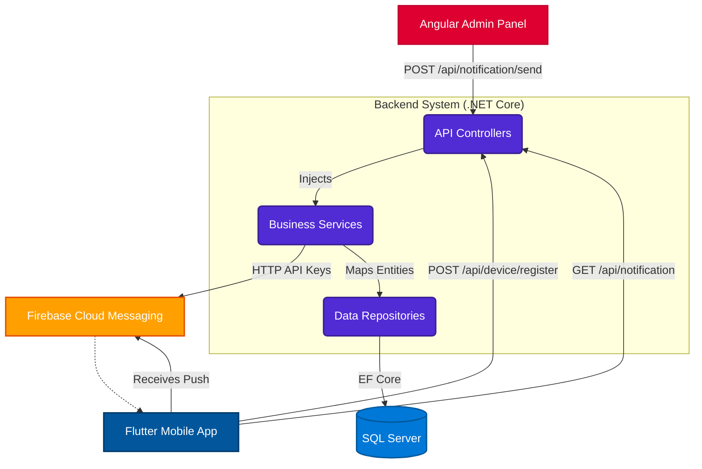

# Remote Notification System Architecture

This document details the architecture of the Remote Notification System, which provides cross-platform real-time push notifications.

## System Components

### 1. ASP.NET Core Backend
The backend serves as the orchestration layer. It follows a strict **N-Tier Architecture** to separate concerns:
- **Core Layer:** Defines domain entities (`Notification`, `Device`, `NotificationLog`) and core repository interfaces.
- **Data Layer:** Implements Entity Framework Core `DbContext` and generic repositories. Handles SQL Server configuration.
- **Business Layer:** Encapsulates business logic, DTO mapping (`AutoMapper`), and external service integrations (`FirebaseService`).
- **API Layer:** Exposes RESTful endpoints, handles HTTP requests, dependency injection, and centralized error handling (Global Exception Middleware).

### 2. Angular Admin Panel
A web-based control panel built with Angular 19. It provides:
- A secure interface for administrators to dispatch notifications.
- API communication via `HttpClient`.
- Real-time visual feedback (success/error handling).
- A history log of previously dispatched notifications retrieved dynamically from the backend.

### 3. Flutter Mobile Application
A cross-platform mobile app structured with the **MVVM Pattern**:
- **Models:** Represents the data layer, parsing JSON to strongly typed Dart objects.
- **Services:** Handles HTTP requests and Firebase Cloud Messaging initializations.
- **ViewModels:** Manages state cleanly separate from the UI, exposing properties mapped by `Provider`.
- **Views:** Renders the UI and reacts to ViewModel state changes.

### 4. Firebase Cloud Messaging (FCM)
FCM acts as the push notification delivery service. The backend uses the FCM HTTP API to send encrypted payloads to device tokens generated by the Flutter application.

## High-Level Architecture Diagram

## Security & Reliability features

- **Global Exception Handling:** The backend captures all unexpected errors, prevents stack trace leakage, and guarantees uniform JSON error payloads.
- **Data Transfer Objects (DTOs):** Prevent mass-assignment vulnerabilities and hide underlying database schemas.
- **Automated Token Refreshing:** The Flutter app quietly registers token refreshes with the backend to ensure high delivery success rates.
