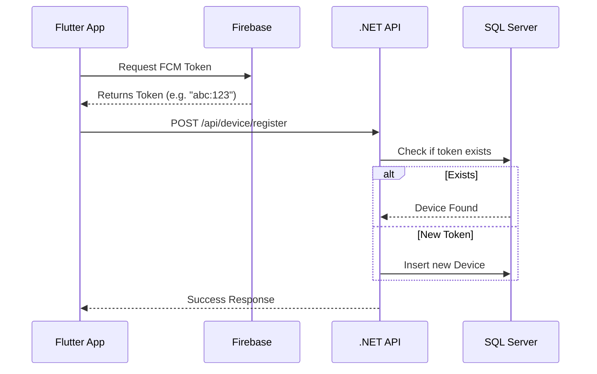
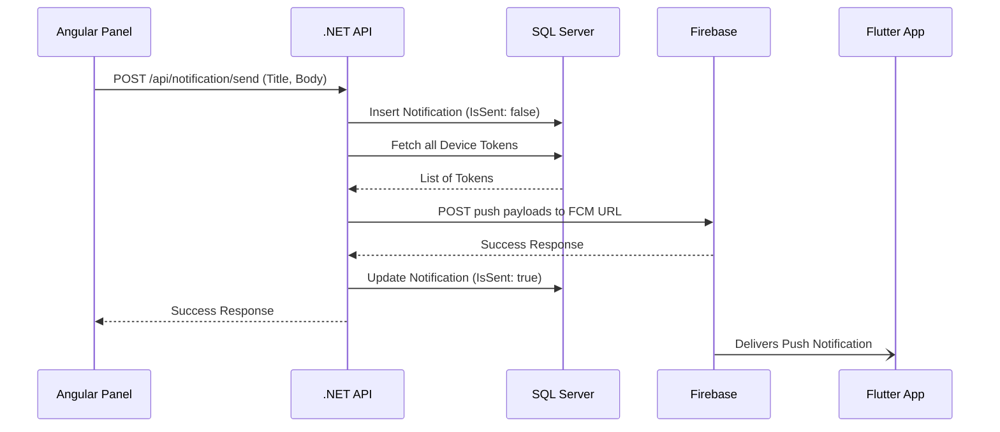

# System Flow & Life Cycle

This document explains the step-by-step data flow across different operations within the Remote Notification System.

## 1. Device Registration Flow

When the user installs and opens the Flutter mobile application:

1. **Initialization:** The app calls `FirebaseService.initialize()`.
2. **Permissions:** The user is prompted for notification permissions (iOS/Android 13+).
3. **Token Retrieval:** The app requests an FCM Token from Firebase servers.
4. **Registration:** The token is HTTP POSTed to the backend via `/api/device/register`.
5. **Database Save:** The .NET API checks if the token exists; if new, it saves it to the `Devices` table.

## 2. Notification Dispatch Flow

When an administrator sends a notification from the Angular panel:

1. **Admin Input:** Admin enters a Title and Body.
2. **HTTP Post:** The Angular service sends a POST to `/api/notification/send`.
3. **Persist Request:** The backend maps the DTO and saves the `Notification` to the database immediately.
4. **Token Fetch:** The backend retrieves all registered device tokens from the `Devices` table.
5. **FCM Dispatch:** The backend packages the payload and dispatches it via the Firebase HTTP API.
6. **Status Update:** The backend updates the `IsSent` boolean flag on the DB record based on FCM success/failure.
7. **Delivery:** The user's device receives the notification and triggers the system tray alert.

## 3. History Retrieval Flow

When the user opens the "All Notifications" screen on their phone or admin panel:

1. **HTTP Get:** App/Panel sends a GET to `/api/notification`.
2. **DB Query:** Backend repositories request records from the database ordered by `CreatedAt` descending.
3. **Payload Mapping:** Entities are mapped securely to `NotificationResponseDTO`.
4. **UI Render:** App/Panel displays the history.
